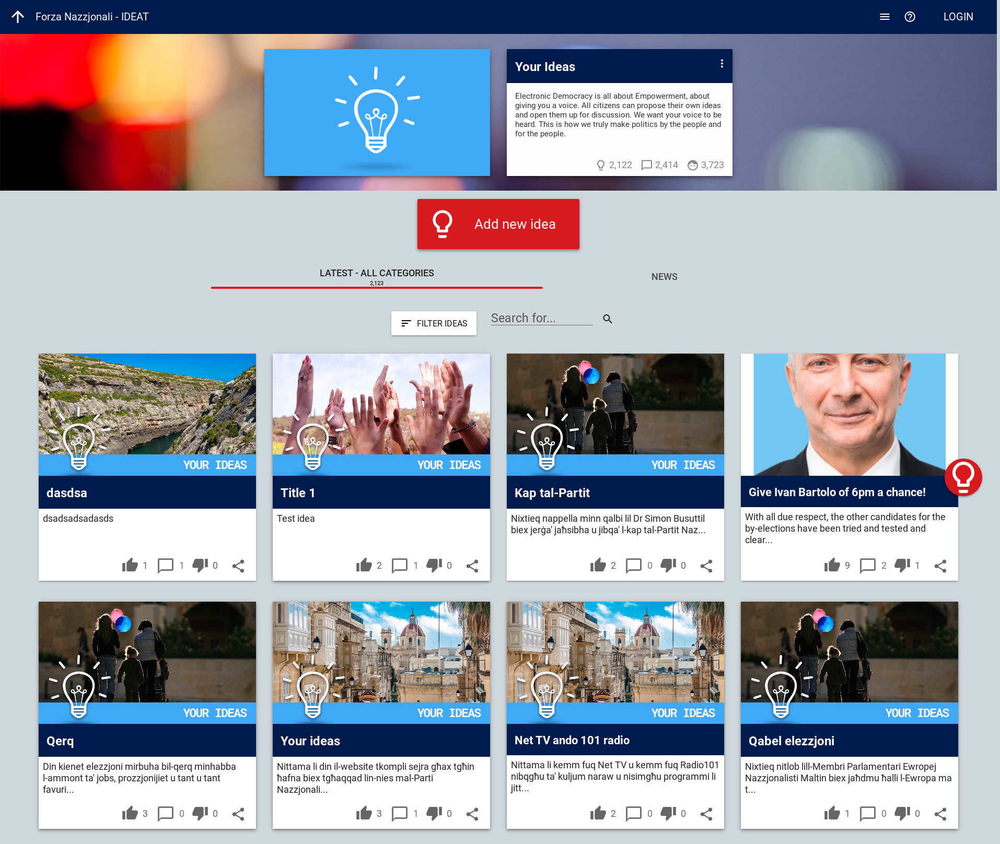
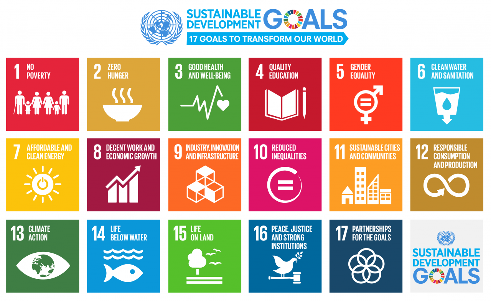
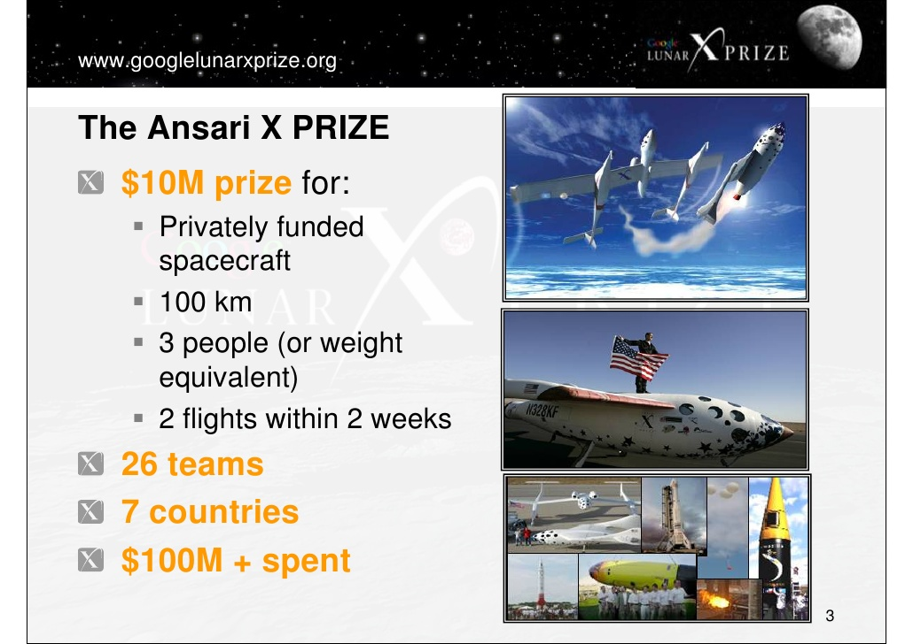
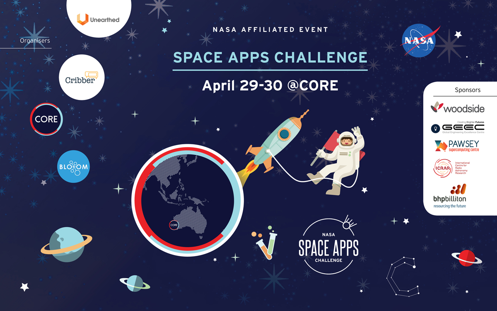
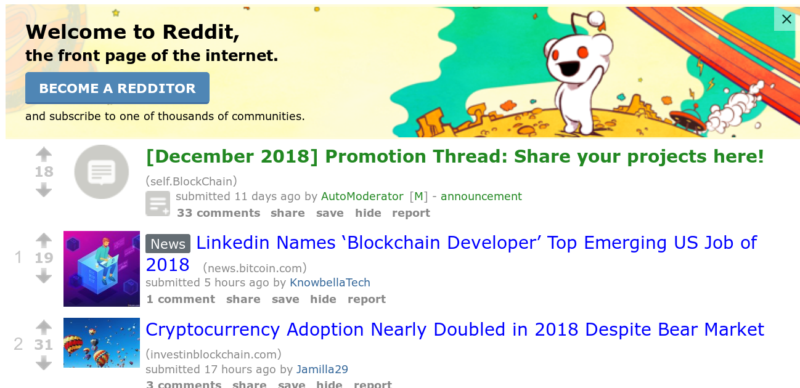

# Newton Developer Grand Challenge: \#unscrewtheworld

# Prerequisites

Before we begin, we *need* these in place:

* Documentation
* Partner MOUs
* Online infrastructure
  * Community website to attract users
  * Developer portal to collate developer info
  * Challenge website to collect and vote on projects
    * Subchain to manage voting
* Promotional materials

---

# Aims

## Attract developers

We're about more than just blockchain, so we can attract IoT, AI, and general developers too.

## Attract users to Newton ecosystem

The world has enough gambling and cryptocurrency apps. Let's build something different and useful.

## Leverage Newton's tech stack

NewChain, NewIoT, NewAI, etc, as well as our USPs like subchains.

---

# How? Global Challenge to Build a Community Economy

Inequality has screwed up the world. With our Community Economy Challenge, we work with the Newton community to #unscrewtheworld

* Attract teams to build Dapps on Newton's ecosystem
* Community votes on what gets funded with NEW tokens
* Meetups, hackathons, workshops in real life and virtually to build community

---

# Types of Projects

Focus on specific scenarios rather than open-ended contest:

* Enable fair commerce
* Cut out middlemen
* Increase equality - "Why are you working for a billionaire when you deserve to be richer?"

---

# Activities

## Offline

* Kick-off hackathons organized by global community
* Ongoing community meetups - tie in with 100 City Tour
* Conferences/workshops/etc

## Online

* Project submission and voting for global challenge
* Virtual meetups for more global coordination
* Youtube/podcast/etc to promote

---

# Infrastructure

We need a dedicated system to solicit proposals, allow feedback and voting, and let projects give regular updates. I've shortlisted [Decidim](https://decidim.org/), [Your Priorities](https://citizens.is/), and [Consul](http://consulproject.org/en/), and I'm presently running deployment tests.

We will also need a workflow for developers to get their Dapps into Newton's Dapp store.

---

# Appendix

---

# How Does Voting Work?

Each month, NEW users are issued voting tokens ("vokens") based on how many NEW they have. 1 NEW = 1 VOK. VOK tokens are:
* Non-transferable - so users can't buy/sell votes
* Time-limited - so users can't save all their vokens for a big vote
* Non-exchangeable - so users can't just cash out their vokens

Vokens are a separate token running on a subchain of Newchain. All voting is performed on this subchain.

Users then transfer their vokens to the projects they like. At the end of the month, the project receives the equivalent amount of NEW from the Newton Foundation.

We could potentially use the voken model for consensus building and voting on other areas of Newton, e.g. NEPs.

---

# Inspiration

---

# [UN Sustainable Development Goals](https://www.un.org/sustainabledevelopment/sustainable-development-goals/)

---

# Developer Challenge like [X Prize](https://www.xprize.org/)

---

# Hackathon like [NASA Space Apps Challenge](https://2018.spaceappschallenge.org/)

---

# Voting like [Reddit](http://www.reddit.com)

Community upvote or downvote candidate projects to decide which get funding

---

# Detailed Processes

---

# Hackathons

## Physical

Teams work together to create prototype and proposal for Newton Developer Challenge

* Aim: Promotion to attract developers to Newton
* Duration: 48-72 hours

Rely on third party services initially, chosen and coordinated by local Newton community where possible. This saves a lot of time and distributes decision-making. Coordinators get NewForce for their work.

Choose sites via how popular blockchain is per city on [Meetup.com](https://www.meetup.com/topics/blockchain/)

Promote via [Devpost](https://devpost.com/) - 400 USD/month

## Virtual

Teams with accepted projects continuously develop their project publicly over Zoom or similar software.

* Aim: Support and promotion of projects 
* Duration: 7-90 days

---

# Project Submission

## Submission criteria

* Must be completely open-source *(which licenses?)*
* Team, not individual
* Must align with challenge goals
* Project lead must have NewID
* Must have white paper, public git repo, blog

---

# Project Selection

## Aims

* Maximize participation and get more verified users involved in ecosystem
* Choose quality projects to fund

## How

* Votes tied to NewID and power determined by NewForce rather than number of NEW held
* Expert advisors to provide feedback and advice via Reddit-like forum
* Initial vote unlocks first set of funding. Upon hitting milestones, teams are assessed on their achievement (via smart contract and oracalization if possible) and Newton users vote on whether to continue their funding for next milestone.

## Voting criteria and weights

In SpaceGAMBIT, we awarded each project a maximum of 20 points, based on the following:

| Criteria  | Description                                                    | Points   |
| ---       | ---                                                            | ---      |
| Relevance | How well does it fit with the goals of the challenge           | 0-5      |
| Team      | How confident are we in the team?                              | 0-5      |
| Realism   | How realistic is this project - technically/economically/time  | 0-5      |
| ???       | Can't remember this one off top of my head. Need to dig it out | 0-5      |
| **Total** |                                                                | **0-20** |

---

# Project Support

To help projects (and thus Newton) to succeed, we need:

* Powerful tools, resources, and documentation on-hand
* Access to advisors and mentors
	* Can use Newton advisors for this
* Marketing support - see later slide

---

# Marketing

## Community Ambassadors

* Find candidate supernodes for ambassadors in target cities (via popularity on [Meetup.com](https://www.meetup.com/topics/blockchain/))
* Each candidate gives presentation on Newton tech via Skype or [Zoom](http://www.zoom.us). Best get selected
* These ambassadors then train other ambassadors
* Ambassadors paid in NEW/NewForce

## Video and Podcasts

Work with Newton Media Team on this, both for promoting the challenge and individual developer projects

* Give developers an ego boost
* Podcast content - top 10 Newton Dapps, developer interviews, community update, etc

## Web

* Landing pages on Newton's website for challenge, hackathons, and each project
* Regular updates to Newton community via social media channels
* Promote events via Meetup.com, devpost, eventbrite, etc
